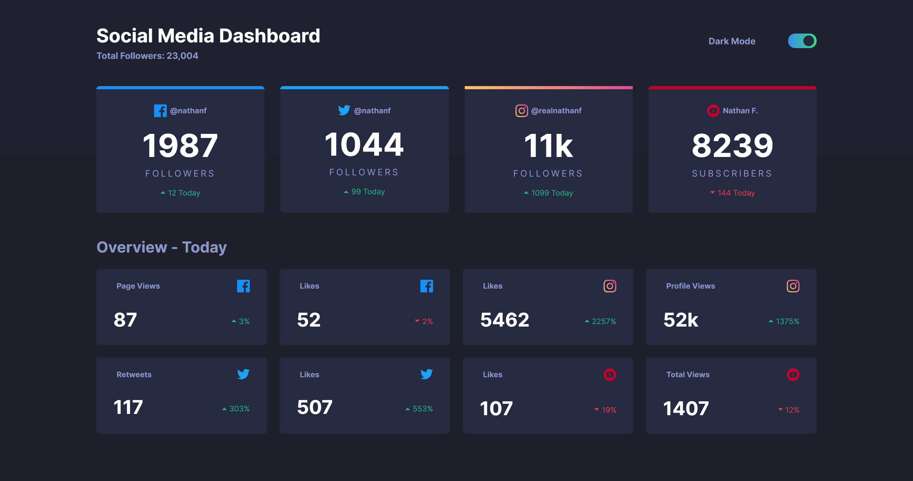

<h1 align="center">Social media dashboard with theme switcher</h1>

<div align="center">
   Solution for a challenge from  <a href="https://www.frontendmentor.io/" target="_blank">Frontend Mentor</a>.
</div>

<div align="center">
  <h3>
    <a href="https://social-media-dashboard-woard.vercel.app/">
      Demo
    </a>
    <span> | </span>
    <a href="https://www.frontendmentor.io/solutions/responsive-page-using-css-variables-for-dark-theme-and-localstorage-mMwu6VAYR">
      Solution
    </a>
    <span> | </span>
    <a href="https://www.frontendmentor.io/challenges/social-media-dashboard-with-theme-switcher-6oY8ozp_H">
      Challenge
    </a>
  </h3>
</div>

<!-- TABLE OF CONTENTS -->

## Table of Contents

- [Overview](#overview)
  - [Built With](#built-with)
- [How to use](#how-to-use)
- [Contact](#contact)

<!-- OVERVIEW -->

## Overview



This is a responsive social media dashboard hosted on [Vercel](https://vercel.com/) that shows some  stats. It also has a theme switcher created with CSS variables.

### Built With

- [Pug](https://pugjs.org/)
- [Sass](https://sass-lang.com/)

## How To Use

<!-- Example: -->

To clone and run this application, you'll need [Git](https://git-scm.com), [Node.js](https://nodejs.org/en/download/) (npm), [Gulp](https://gulpjs.com/docs/en/getting-started/quick-start/) and [Babel](https://babeljs.io/docs/en/babel-cli) installed on your computer. From your command line:

```bash
# Clone this repository
$ git clone https://github.com/BrandonSdvl/Social-media-dashboard.git

# Install dependencies
$ npm install

# Run server
$ gulp
```

## Contact

- GitHub [@BrandonSdvl](https://github.com/BrandonSdvl)
